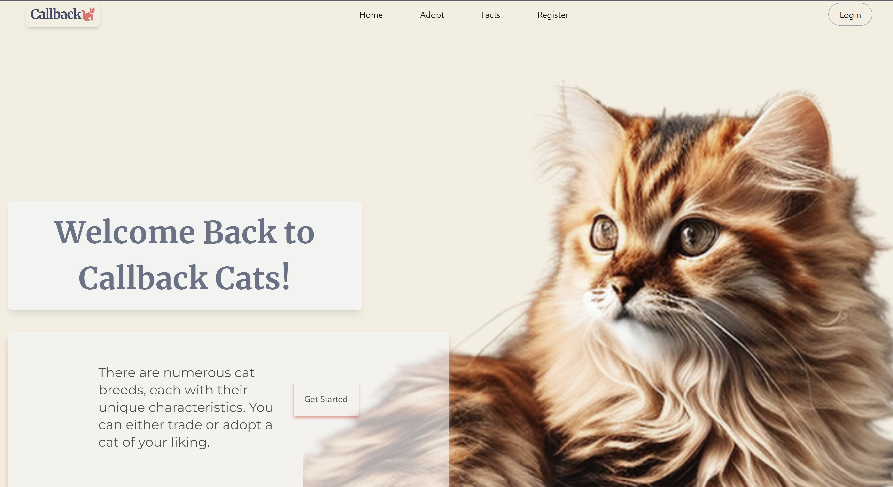
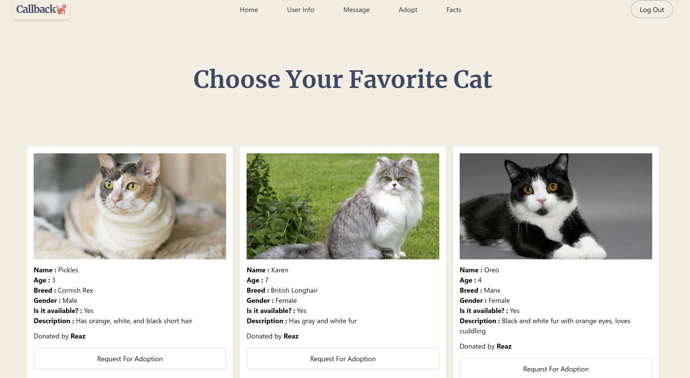

# Callback Cats
We are Callback Cats, a cat-themed e-commerce platform. Our mission is to provide cat lovers around the world with the best experience with exploring cat breeds. At Callback Cats, we understand that cats are more than just pets - they are family members. That's why we only offer the most friendly user experience to meet the needs of both cats and their owners. There are numerous cat breeds, each with their unique characteristics in this website. You can either trade or adopt a cat of your liking.
#
 
#

# How To Run The Website
First, you need to install the flask dependencies and react node_module to run this website

### How To Install Dependencies
- You need to install flask dependencies inside the server folder.
   * First, type 'cd src/src'. After this, install below dependencies
   * For windows users, you need follow command:
      - pip install flask
      - pip install flask_sqlalchemy
      - pip install flask_bcrypt
      - pip install flask_cors
      - pip install flask_login
    * For mac users, you need to add 'sudo' infront of each of those above commands
- Now, open another terminal. Then, you need the install react node_modules through below command:
  * npm install
 
3. Open your browser and visit `http://localhost:3000` to access the application.

4. Explore the website to view available cats for adoption and learn more about each cat.

5. If you would like to donate a cat, please contact our team through the provided contact information on the website.

## Technologies Used

- Frontend:
- TypeScript: A statically-typed programming language that enhances the development experience.
- React with Vite: A modern, fast, and lightweight tooling setup for building React applications.
- Tailwind CSS: A utility-first CSS framework that provides a wide range of pre-built components and styles.

- Backend:
- Flask: A lightweight web framework for building RESTful APIs in Python.
- Flask SQLAlchemy: An ORM (Object-Relational Mapping) library that simplifies database operations in Flask applications.

## Contributing

Contributions are welcome! If you would like to contribute to CallbackCats, please follow the steps below:

1. Fork the repository.

2. Create a new branch:

3. Make your desired changes and commit them:

4. Push your changes to your forked repository:

4. Push your changes to your forked repository:

 
 ### Now, you need to do is type below commands to start the website:
   * First, go to server folder and type 'python main.py'
   * Then, open another terminal and type 'npm start'

